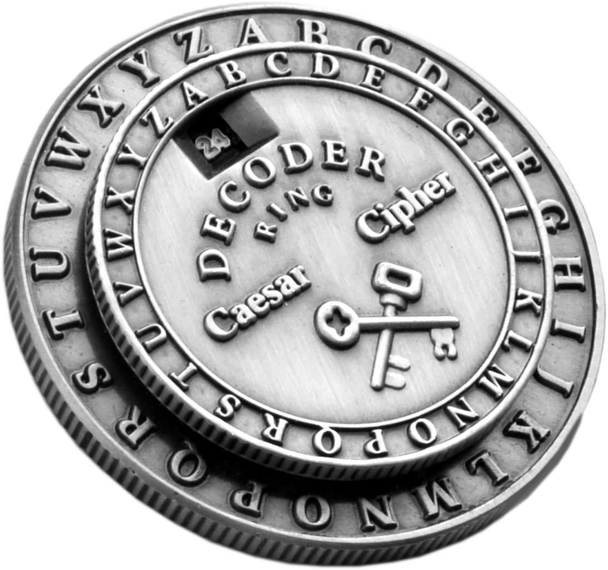
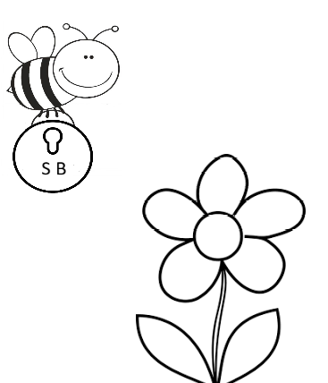

# **PRIMEIRO PROJETO - LABORATORIA**

## **ÍNDICE:**
1. [PROJETO ESCOLHIDO](#PROJETO-ESCOLHIDO)
2. [RESUMO DO PROJETO E PUBLICO ALVO](#RESUMO-DO-PROJETO-E-PUBLICO-ALVO)
3. [PROPOSTAS DE USUÁRIO](#PROPOSTAS-DE-USUÁRIO)
4. [OBJETIVOS DE APRENDIZAGEM ALCANÇADOS](#OBJETIVOS-DE-APRENDIZAGEM-ALCANÇADOS)
5. [DEPLOY DO PROJETO](#DEPLOY-DO-PROJETO)

# PROJETO ESCOLHIDO

Em razão de ser o meu primeiro projeto, escolhi a <strong>Cifra de César (clique <a href="https://pt.wikipedia.org/wiki/Cifra_de_C%C3%A9sar" target="_blank">aqui</a> para ler sobre)</strong> devido a um menor grau de dificuldade e proposta mais simples.

Com o advento dos aplicativos de troca de mensagens instantâneas, é de extrema importância a utilização de plataformas que possuem a tecnologia de criptografia, para uma maior segurança.

Sabe-se que quando acessamos a internet estamos vulneráveis a coleta de dados não autorizados, desta forma, achei interessante utilizar esse método simples para uma maior compreensão desses mecanismos de segurança. Acredito que esse projeto me ajudou a compreender e aplicar os princípios básicos de lógica de programação JS auxiliando na minha formação como desenvolvedora web.

# RESUMO DO PROJETO E PUBLICO ALVO

Imaginei a criação de uma aplicação web visualmente objetiva que fosse adequada a simplicidade da proposta do projeto.

Com o auxílio do aplicativo FIGMA iniciei a criação de um protótipo (https://www.figma.com/file/VlhZ55llqn8NyBHKSyWcjM/Untitled?node-id=0%3A1) e com base nele realizei uma pesquisa UX que constituiu apenas em uma breve apresentação do conteúdo às pessoas do meu convívio social.
Através dessa breve pesquisa iniciei o desenvolvimento da aplicação web sempre com a intenção de que a experiência de usuário no site fosse rápida, fácil e segura.

Atualmente nos deparamos com crianças portando tablets e aparelhos celulares com aplicativos de mensagens instalados os quais já utilizam para troca de mensagens com seus parentes e amigos. Desta forma, imaginei um sistema de segurança baseado na Cifra de César que fosse ainda mais fácil compreender e destinado a crianças que já iniciaram a leitura e a escrita o que ocorre por volta dos 7 anos de idade abrangendo também, toda a idade adulta.

Os desenhos e imagens presentes neste projeto remetem aos utilizados para colorir nas escolinhas. A abelha aqui funciona como uma portadora da mensagem segura por isso o nome SecureBee.
Ao lado direito da página posicionei uma imagem de colorir de uma avenida em uma grande cidade pois a colmeia das abelhinhas da SecureBee seriam um ambiente urbano.

Sabemos que as abelhinhas, na natureza, são importantes polinizadoras e fazem o papel de transportar os polens de uma flor masculina para uma flor feminina. As abelhinhas que imaginei para a SecureBee seriam as responsáveis pelo funcionamento de todo o mecanismo da Cifra de César. Os polens seriam o deslocamento das letras, a polinização seria a função cifrar e a despolização (palavra criada por mim) seria a função de decifrar.

Através desse mecanismo as abelhinhas fariam um trajeto fictício, portando a mensagem do usuário para que seja cifrada ou decifrada de acordo com a opção escolhida.

# PROPOSTAS DE USUÁRIO

Estas são as propostas destinadas ao usuário:

1. Possibilidade de codificar suas mensagens, tornando-as secretas através da escolha de um número de deslocamento (pólen) e das opções cifrar (polinizar) e decifrar (despolinizar);
2. O usuário poderá escolher um número de deslocamento (pólen) de 0 a 26 que deverá ser secreto podendo ser compartilhado apenas com as pessoas as quais o usuário deseje possibilitar decifrar (despolinizar) a sua mensagem cifrada (polinizada);
3. Possibilidade de copiar e compartilhar sua mensagem através de qualquer plataforma de troca de mensagens, bastando apenas que o usuário compartilhe o aplicativo web juntamente com a mensagem cifrada (polinizada) e o número de deslocamento (pólen);

Breve demonstração:

  

# OBJETIVOS DE APRENDIZAGEM ALCANÇADOS

Este projeto veio acompanhado de uma lista de objetivos de aprendizagem, sendo assim, segui todas as recomendações contidas no README do projeto tentando sempre aprimorar o conhecimento nos tópicos ressaltados pela equipe. Aprimorei minhas habilidades nos seguintes tópicos:

- SELETORES CSS;
- HTML SEMÂNTICO;
- VANILLA JAVASCRIPT;
- PRIMEIROS PASSOS DO UX;
- MANIPULAÇÃO DO DOM;
- GIT/GITHUB;

# DEPLOY DO PROJETO

Este projeto está disponível para utilização e visualização online através do seguinte endereço web (URL):

- https://natalieiss.github.io/Primeiro-Projeto-CifradeCesar/

Para utilizar este endereço web (URL) o usuário deverá ter instalado em seu dispositivo um navegador web (Google Chrome, Mozilla Firefox, Internet Explorer e outros).

Acessando o endereço web (URL) o usuário já estará apto a utilizar todas as funcionalidades disponíveis.
